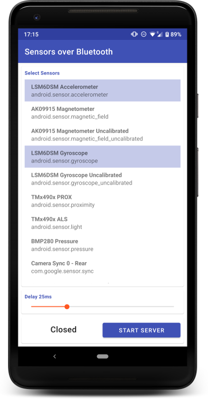

### What?
Send over bluetooth the data coming from the device's sensors like accelerometer and gyroscope.

### Why?
Sometimes you just need to analyse the data coming from those sensors on your laptop with a specific software

### How to use:
1. Pair the smartphone and your laptop or any other bluetooth device through system interface
2. Open this app on your smartphone
3. Select from the app the sensors you need
4. Tap on "Start Server"
5. Connect through Bluetooth SPP from your laptop as client - server UUID: 00001101-0000-1000-8000-00805F9B34FB
6. This app will start sending on the bluetooth socket the sensor events with this format:  `sensor_type;timestamp;value0;value1;value2;....valueX;`